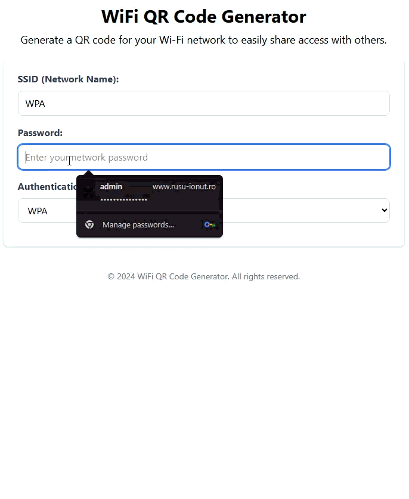

# Vue 3 QR Code Network Generator

A modern WiFi QR Code Generator built with Vue.js 3, TypeScript, Pinia, and TailwindCSS. Instantly generate QR codes for your WiFi networks that allow guests to connect effortlessly by scanning with their devices.



## 🚀 Demo

- **Live Demo**: [https://johnrusu.github.io/vue-qr-code-network-generator/](https://johnrusu.github.io/vue-qr-code-network-generator/)

## ✨ Features

- **Multiple Authentication Types**: Support for WPA, WEP, and open (no password) networks
- **Real-time Validation**: Instant form validation with visual feedback
- **Smooth Animations**: Beautiful loading animations powered by Lottie
- **State Management**: Efficient form state handling with Pinia
- **Print & Download**: Print-ready QR codes with dedicated download functionality
- **Responsive Design**: Mobile-friendly interface built with TailwindCSS
- **Router Navigation**: Seamless navigation between home and print views
- **Auto-scroll**: Smooth scrolling to generated QR code
- **Error Handling**: Comprehensive input validation and error messages

## 🛠️ Technologies Used

- **Vue.js 3** - Progressive JavaScript framework
- **TypeScript** - Type-safe development
- **Pinia** - Modern state management
- **TailwindCSS** - Utility-first CSS framework
- **Lottie-web-vue** - Animation library integration
- **Vue Router** - Client-side routing
- **Playwright** - End-to-end testing
- **Vitest** - Unit testing framework
- **Ramda** - Functional programming utilities
- **Vite** - Next-generation build tool

## 📋 How to Use

1. Enter your WiFi network SSID (network name)
2. Enter your network password
3. Select the authentication type (WPA, WEP, or nopass)
4. Click "Generate QR Code"
5. Share or print the generated QR code
6. Guests can scan the QR code to connect automatically

## 🏗️ Project Setup

```bash
# Install dependencies
npm install

# Run development server
npm run dev

# Build for production
npm run build

# Run unit tests
npm run test:unit

# Run e2e tests
npm run test:e2e

# Lint and fix files
npm run lint

# Format code
npm run format
```

## 📦 Project Structure

```
src/
├── assets/          # Static assets and animations
├── components/      # Vue components
├── constants/       # Application constants and labels
├── router/          # Vue Router configuration
├── stores/          # Pinia stores
├── utils/           # Utility functions
└── views/           # Page components
```

## 🧪 Testing

- **Unit Tests**: Vitest for component and utility testing
- **E2E Tests**: Playwright for end-to-end browser testing

## 📄 License

© 2024 WiFi QR Code Generator. All rights reserved.

## 👤 Author

**Rusu Ionut**

- GitHub: [@johnrusu](https://github.com/johnrusu)
- LinkedIn: [Ionut Rusu](https://www.linkedin.com/in/ionut-rusu-1035b112)
- Website: [rusu-ionut.ro](https://rusu-ionut.ro)
