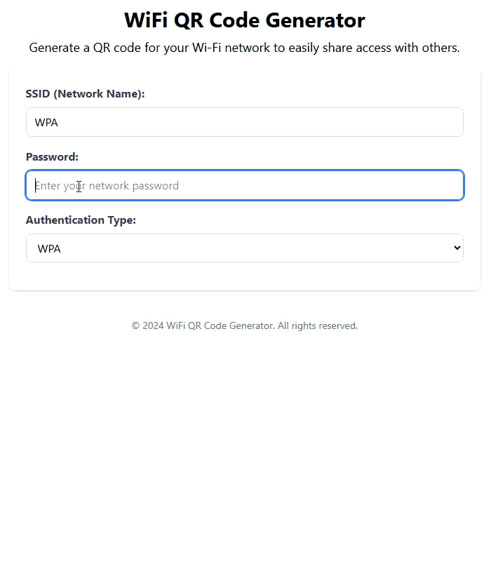

# Vue 3 Qr Code Network Generator

Tehnologies used: VueJs 3, Typescript, Pinia, Playwright, Tailwind

A modern WiFi QR Code Generator built with Vue.js 3, TypeScript, Pinia, and TailwindCSS. Instantly generate QR codes for your WiFi networks with support for WPA, WEP, and open networks. Features include real-time validation, smooth animations with Lottie, form state management, print-ready downloads, and responsive design. Simply enter your network SSID, password, and authentication type to create shareable QR codes that allow guests to connect effortlessly by scanning with their devices.

Demo:
- https://johnrusu.github.io/vue-qr-code-network-generator/
